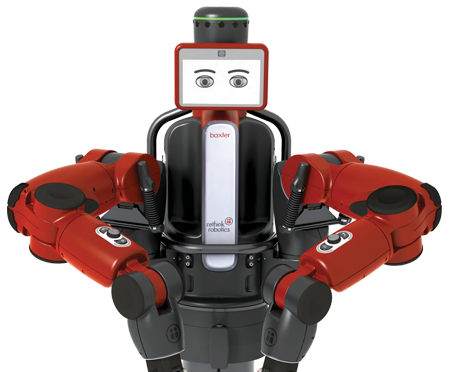

# :robot: THE AMAZING BAXTER "FEEDING ROBOT" TESIS :robot:
This is our repository to work on multiple projects and experiments related to the thesis. 
The thesis will be programmed using [Baxter Robot](https://en.wikipedia.org/wiki/Baxter_(robot)) as the main system to achieve a educational 
approach of a "Feeding Robot" that helps people with disabilities to properly eat food without having a person explicitly feeding them. 

We will be working on multiple projects like:
* Computer Vision for face_detection and anomalies_recognition.
* Robotics algorithms developed for Baxter robot.
* Architecture of multiple nodes using ROS and some of our own-designed packages.
* Some important notes, tests and analysis to keep in mind when working with Baxter robot.

  

---

## SOFTWARE DEPENDENCIES :loudspeaker:
* [Visual Studio Code](https://code.visualstudio.com/)  
Visual Studio Code is our main code editor for [Python](https://www.python.org) scripts and high-level programming. 
This is not absolutely necessary, but from our experience, it gives us a great performance and we can link it with Git and Github easily. 

* [Python](https://www.python.org/)  
Python is the main programming language that lets us work fast, with easy and powerful integration of different software solutions. 

* [Robot Operating System (ROS)](https://www.ros.org)  
Baxter robot implements ROS with a set of software libraries and tools that helps us build robot applications with complex robotic-systems. 
We will be implementing the native ROS-architecture in our projects to control, configure, test, and design our Baxter programs. 

* [MATLAB](https://www.mathworks.com/products/matlab.html)  
MATLAB is NOT a necessary dependency, but some of the first mathematical tests and plots were developed in MATLAB.  
It is NOT a mandatory tool to have, but we will upload the MATLAB scripts in case someone needs them.  

### Extra Dependencies :vertical_traffic_light:
The dependencies are mainly python libraries and the correct usage of them.  
Our advice is to have a good understanding the [pip](https://pypi.org/project/pip/) (Package Installer for Python), before working with other dependencies. 
It is also a good practice to work with [virualenv](https://virtualenv.pypa.io/en/latest/), to isolate correctly the main projects. 

* [Numpy](https://numpy.org/)  
NumPy is a great resource to work with arrays and concepts of linear algebra. This allows us to work with data and achieve scientific computing

* [Matplotlib](https://matplotlib.org/)  
This is a great Python library for creating static, animated and interactive data visualizations in a simple way.

* [OpenCV](https://opencv.org/)  
OpenCV is an amazing Open Computer Vision Library, that enables great tools, resources and methods to process and work with images. It is closs-platform and has multiple language connections. In these repository we will be working in Python, but you are free to work in your prefered programming language.

* [Tkinter](https://docs.python.org/2/library/tkinter.html)  
Tkinter is an integrated Library that gives us a great way to create GUI windows with Python. It is also a cross-platform that has the 
advantage of working with the classic Tk windows and many libraries that integrate together to achieve amazing projects.

---

## COMPUTER VISION PROJECTS :closed_book: :green_book: :blue_book:
There are packages for Computer Vision algorithms focused on face_detection and anomalies_detection.  

The main library used for Compter Vision packages is [OpenCV](https://opencv.org) and comes really handy for our projects, 
because it can be programmed in [Python](https://www.python.org) or [C++](https://www.cplusplus.com), giving us a perfect 
match with the native Baxter [Robot Operating System](https://www.ros.org) infrastructure and programs.

To dive deeper into the structure of these projects, you can go to:

* [Face Detection Algorithm With Haar Cascade Classifier](python/computer_vision/face_detect_haar_cascade)
* [Face Detection Algorithms With Face Recognition Library](python/computer_vision/face_detect_face_recognition)

---

## USAGE :pencil2:
All projects are really well commented. Most of them have specifications in the README.md section and remarks for their purpose and I/O workflow.  
We will be uploading most of the files, and try to keep it as clean as possible. 
* Some video tests won't be uploaded, so that we don't have many binaries in the version control system. 

---

## AUTHORS :musical_keyboard:

### Santiago Garcia Arango
  

Student of Mechatronics Engineering at EIA University, excited for creating Software solutions.  
He is curious about implementing Clean Code architectures, a DevSecOps culture and building strong connections with his teams.   
He has skills leading and working in teams. He is passionate about sharing his knowledge and learning the art of how everything actually works.  

### Elkin Javier Guerra Galeano
  

Student of Mechatronics Engineering at EIA University, excited for integrating Software and Hardware systems.  
He is curious about Control Theory and implementing Robotics Solutions with different math designs.  
He has skills with problem-solving for real-life applications. He is passionate about building knowledge from a theory-practice approach.  

---

## SPECIAL THANKS :gift:
* Thanks to our professors and friends: Dolly Tatiana Manrique Espindola.
* Thanks to all contributors for the great OpenSource projects that we are using. 
